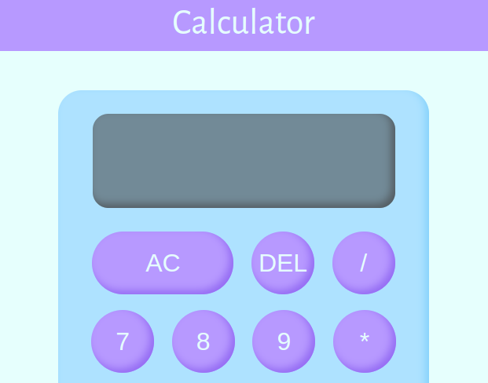

# Calculator

This is a simple calculator application developed using HTML, CSS, and JavaScript. The calculator allows users to perform basic arithmetic operations such as addition, subtraction, multiplication, and division.
Note: This version is more short and comprensible than the other repository called 'calculator'.

## Features

- **Basic Operations**: Supports addition, subtraction, multiplication, and division.
- **Clear Display**: Clear the entire input using the "AC" button.
- **Delete Function**: Remove the last entered digit using the "DEL" button.
- **Responsive Design**: Works well on different screen sizes.

## How to Use

1. **Enter Numbers**: Click the number buttons to enter digits.
2. **Select Operation**: Click the operation buttons (+, -, *, /) to choose the arithmetic operation.
3. **Compute Result**: Click the "=" button to compute the result.
4. **Clear Display**: Click the "AC" button to clear all inputs.
5. **Delete Digit**: Click the "DEL" button to delete the last entered digit.

## Technologies Used

- **HTML**
- **CSS**
- **JavaScript**

## Demo
You can view a live demo of the project [here](https://ceciliarava1.github.io/calculator-1.0/).

## Screenshot



## Setup

1. Clone the repository:
    ```bash
    git clone https://github.com/CeciliaRava1/calculator.git
    ```
2. Open `index.html` in your browser to use the calculator.

## Author

- **Cecilia Rava**
    - [LinkedIn](https://www.linkedin.com/in/cecilia-r-127779246/)
    - [GitHub](https://github.com/CeciliaRava1)
